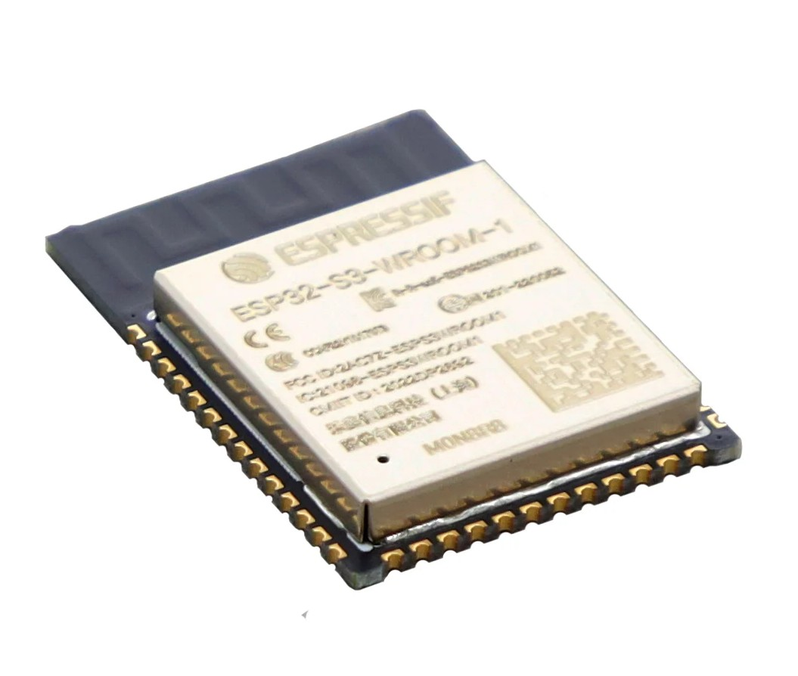
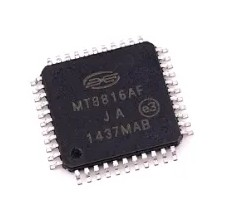
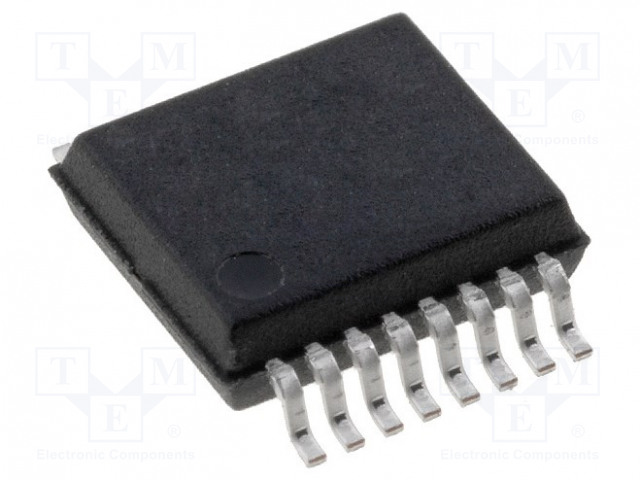
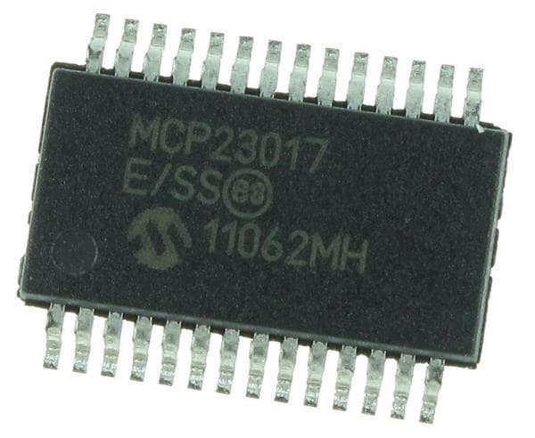
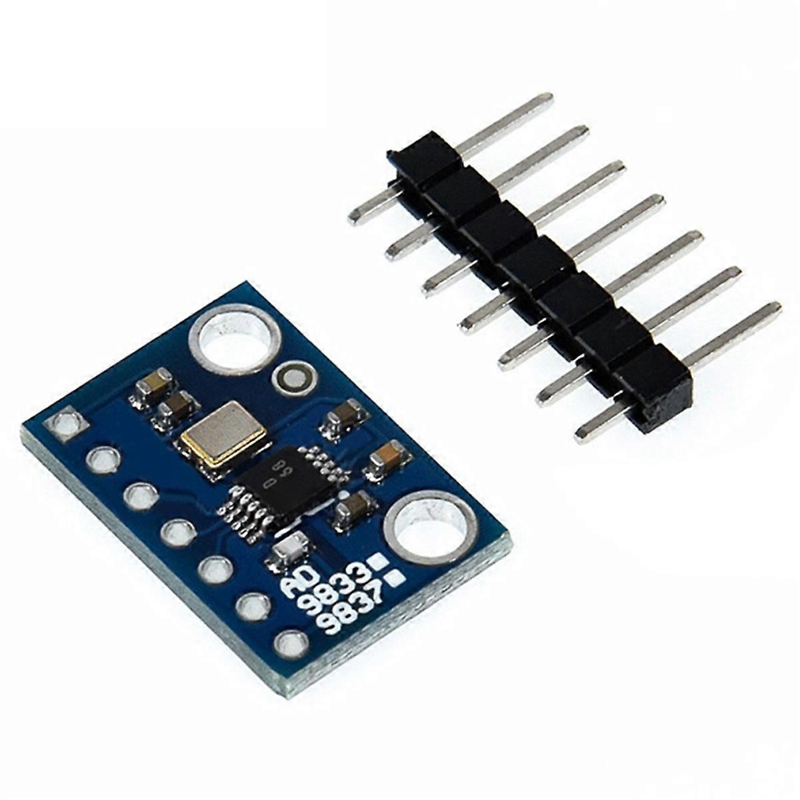
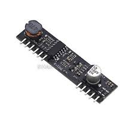

# Phone Exchange - (Under development) # 

## Thanks to! ##

First of all, I want to thank my partner Amanda, who has beed som patiant whit me - spending countless hours and weekends by my computer while I, for example, trying to figure out a way to capture pulses from rotary phones, or comforting during mental breakdowns when I was sodering without realizing I was using to low temperatur. If you are reading this - which you might not, since you're probebly so tierd of this project - I just want to say that i love you, and do that even more for standing out with me and my stupid phones.

I would also like to thank two GitHub members from whom I’ve drawn a lot of inspiration.

1. [GadgetReboot](https://github.com/GadgetReboot) with his YouTube videos and repositories about the KS0835F SLIC module and the MT8816 switch matrix, really made this project possible.

3. [Ktownsen](https://github.com/ktownsend-personal/) and his repository [RetroPhone](https://github.com/ktownsend-personal/RetroPhone) showed me that there is someone else out there who thinks an old wired phone network would be cool, and who shares the same passion for making vintage phones work just like they did back in the day. My call process modes and flows are heavily inspired by his work.

## Goal whit the project ##
The project aims to create a local wired phone network that supports both old rotary phones and newer DTMF tone-dialing phones. No intelligence or electronics will be built into the phones themselves; all logic and switching will be handled by the exchange unit. The network will follow a star topology, with two wires leading to each phone.

The goal is for the network to behave just like it did back in the day. Features such as ringing behavior, tones, and call logic will be implemented.

This is a learning project and my personal introduction to programming, Arduino, HTML, and electronics. It might eventually result in nothing more than a pile of electronic scrap and hundreds of non-functional lines of code—but it will definitely provide me with valuable knowledge and a steep learning curve.


### Typical behaviour for all call ###

A typical procedure of the system will be as shown below.
- A hook is lifted, and the status of the line changes from "idle" to "ready."
- A phone number is dialed using pulse dialing or DTMF tones, and the digits are captured by the microcontroller.
- Ring pulses are generated for the dialed line. Once the hook is picked up, the audio lines are connected between the two lines and the conversation can begin
- Ones one of the connected phones puts it's handset into the crank, the audio connection between the lines breaks and the call ends

## Hardware ##
<p align="center">

</p>

| Component   | Description |
|-------------|-------------|
| ESP32-S3<br>  | - I have always appreciated the ESP family of microcontrollers. After first experimenting with Arduino modules such as the Arduino Uno and Arduino Uno WiFi, it quickly became clear that the ESP32 offered significantly more features at a lower cost. <br> - This module includes 8 MB of flash memory — an important improvement, since the 4 MB version ran out of space during earlier POC work. <br> - Like most ESP chips, it also provides both WiFi and Bluetooth, which are used here for the webserver and WiFi provisioning. The ESP32-C6 was initially considered due to its support for Matter and Zigbee. However, at the time it was not supported in PlatformIO, so the more common ESP32-S3 was selected for this project.
| MT8816<br>               | The MT8816 is a crosspoint swich matrix where you can connect one phone lines audio out to a certain lines audio in, and of course also in the opposite direction so a full audio connection is established more about how it works can be found [here](src/services/Readme.md)       | 
| MT8870<br>            | This circuit translates all tones from DTMF phones into digits.     |
| MCP23017            | GPIO expanders because the ESP32 do not have enough GPIO ports to control all devices                  |
| AD9833 module         | The AD9833 module, which I have three of in the exchange Is sending out tones into the swich matrix and then thuther to lines.               |
| KS0835F<br>          | This module may be the most important one on the breadboard. It handles the phone's behavior and converts it into signals that my ESP can process. It detects whether the phone's hook is on or off and can generate a ring frequency, which would otherwise be very complicated to produce.     |

## Webserver ##
I thought it would be good to have an interface where you could manage the phone system in some way, such as assigning a phone number to a specific line, activating/deactivating lines, changing the ring tone length, and adding some more features. During operation, access to the serial monitor will be limited, so having a way to easily tweak settings and access some debugging information would be useful.

The webserver can be reached at http://phoneexchange.local/ after the provisioning is completed

## MQTT ##
Having an MQTT function is also a goal so that the server can potentially interact with a smart home system such as Home Assistant, opening up the possibility to control home functions — just for fun!

## Line Statuses ##

To handle the logics in the exchange system, all lines has a current status whish triggers different logics in the system when they are changed.

### Status table ###
- Hook  :telephone_receiver: - If the phone hook is on or off due to the status
- Timer :stopwatch: - If the new status initiate a timer
- Audio :loud_sound: -  If a audio is played to the line due to the status (might not be implemented)
- Tone :postal_horn: - if a tone is played to the line due to the status

| Phone status  | Function                              | Hook     | Timer | Audio | Tone |
| ------------- | ------------------------------------- | -------- | ----- |-------|------| 
| idle          | Line is not in use                    | ✅ ON    | ❌    | ➖    | ❌   |
| ready         | Line is ready, waiting for inputs     | ⚪ OFF   | ✅    | ➖    | ✅   |
| puls_dialing  | Rotary dialing in progress            | ⚪ OFF   | ✅    | ➖    | ❌   |
| tone_dialing  | Touch-tone dialing in progress        | ⚪ OFF   | ✅    | ➖    | ❌   |
| busy          | Receiving busy signal                 | ⚪ OFF   | ✅    | ➖    | ✅   |
| fail          | Line failed to connect                | ⚪ OFF   | ✅    | ➖    | ✅   |
| ringing       | Line is ringing (outgoing call)       | ⚪ OFF   | ✅    | ➖    | ✅   |
| connected     | Call is active                        | ⚪ OFF   | ❌    | ➖    | ❌   |
| disconnected  | Call has ended, but line not yet idle | ⚪ OFF   | ✅    | ➖    | ❌   |
| timeout       | Line timed out                        | ⚪ OFF   | ✅    | ➖    | ✅   |
| abandoned     | Line was abandoned                    | ⚪ OFF   | ✅    | ➖    | ✅   |
| incoming      | Incoming call                         | ✅ ON    | ❌    | ➖    | ❌   |
| operator      | Connected to operator                 | ➖       | ❌    | ➖    | ❌   |

### Status flow chart ###
The flowchart below shows how the statuses change based on the behavior of the phone hooks or when status timers expire.

  <a href="https://raw.githubusercontent.com/ondfrukt/phone-exchange/main/docs/StatusflowChart.drawio.svg">
    
  </a>

## Debugging ##

The project now includes comprehensive debugging capabilities for troubleshooting DTMF signal detection and other subsystems.

### Quick Start: DTMF Debugging

If you're experiencing issues with DTMF tone detection, enable debug output by setting these values in your code:

```cpp
// In App::begin() after settings.resetDefaults():
settings.debugTRLevel = 1;   // ToneReader debug level 1-3
settings.debugMCPLevel = 1;  // MCP interrupt debug level 1-2
```

**Debug Levels:**
- **Level 1**: Basic - Shows interrupts, decoded digits, and errors
- **Level 2**: Detailed - Includes GPIO states, edge detection, and register values  
- **Level 3**: Full - Adds periodic status checks and heartbeats

**Documentation:**
- 📖 [Complete DTMF Debugging Guide](docs/DTMF_DEBUGGING.md) - Full documentation in English
- 🇸🇪 [DTMF Felsökning Snabbguide](docs/DTMF_FELSÖKNING_SNABBGUIDE.md) - Quick reference in Swedish

The debug output helps you trace the signal flow step-by-step:
1. Check if ESP32 receives interrupts from MCP
2. Verify MT8870 signals reach the MCP  
3. Monitor GPIO pin states (Q1-Q4)
4. See decoded DTMF values
5. Track line assignment

### Example Debug Output

When a DTMF key is pressed successfully (Level 1):
```
DTMF: STD interrupt detected - addr=0x27 pin=11 level=HIGH
DTMF: Rising edge detected - attempting to read DTMF nibble
DTMF: MT8870 pins - Q4=0 Q3=1 Q2=0 Q1=1 => nibble=0b0101 (0x5)
DTMF: DECODED - nibble=0x5 => char='5'
DTMF: Added to line 0 digit='5' dialedDigits="5"
```

## Challenges ##

- **Identify DTMF-toned to a line**

It is quite difficult to identify which phone line is actually starting to tone dial. The lines and tones from them are all sent into the DTMF decoder on just one line, and if, for example, two phones have both gone off-hook and are ready to dial, how can you tell which one the tone is coming from?
My solution to this is simply to assume that the last phone picked up is the one entering a DTMF number. I have a maximum of 8 lines in my project, so this approach works for me — but it’s not an ideal solution.


